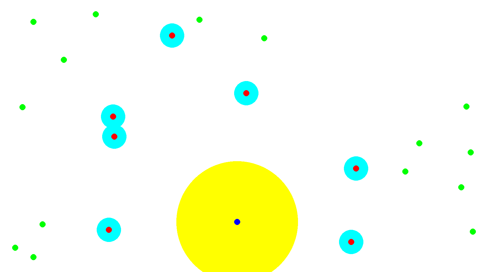

# Code Vs Zombie

This code is for competition "Code Vs Zombie" on [Codingame](https://www.codingame.com/ide/puzzle/code-vs-zombies)


---

## Requirments

- [Python 3](https://www.python.org/)
- [Poetry](https://github.com/python-poetry/poetry)

---

## Install

1. Clone repository

```bash
git clone https://github.com/CodeVsZombie/code-vs-zombie.git
```

2. Move into directory

```bash
cd code-vs-zombie
```

3. Install dependencies using `poetry` package manager

```bash
poetry install
```

---

## Run test

```bash
poetry run pytest
```

---

## Run simulation

```bash
poetry run simulator <simulation-name>
```

> `simulation-name` must be the name of one file inside `simulations` without .siml extension



> :large_blue_circle: `blue_dot` is Ash  
> :yellow_square: `yellow_circle` is Ash attack range  
> :red_circle: `red_dot` are Zombies  
> :blue_square: `blue_circle` are Zombies attack range  
> :green_circle: `green_dot` are Humans

### Simulation File Format

a simulation is a file containins the initial state of the game, where each row represent an entity into the game.

Entity are represented using the following syntax:

| Entity | Format                   |
| ------ | ------------------------ |
| Ash    | `A X Y`                  |
| Human  | `H ID X Y`               |
| Zombie | `Z ID X Y NEXT_X NEXT_Y` |

simulation example:

```text
A 8000 4500
H 0 3000 4500
H 1 14000 4500
Z 0 2500 4500 2900 4500
Z 1 15500 6500 15260 6180
```

to create a custom simulation, create a `<simulation-name>.siml` file into `/simulations`

---

## Game Objective

- [ ] Save Always max human possible even if we hate them
